# The kerbe lifecycle — one project, many slices, two loops

How a project becomes slices, how a slice is built, and the two loops that decide when it is
finished. Every project-specific value in the diagram resolves through `kerbe.yml` and the
adapters — no skill hardcodes a path, a command, or a dispatch mechanism.

```mermaid
flowchart TB
    classDef skill fill:#1f6feb,stroke:#0b3a80,color:#ffffff
    classDef artifact fill:#f6f8fa,stroke:#57606a,color:#24292f
    classDef gate fill:#fff4e5,stroke:#bc4c00,color:#24292f
    classDef seam fill:#eef6ec,stroke:#2da44e,color:#24292f
    classDef done fill:#2da44e,stroke:#1a7f37,color:#ffffff
    classDef planned fill:#eef3fb,stroke:#1f6feb,stroke-dasharray:6 4,color:#0b3a80

    CUT{"Cut a vertical slice — sized for efficiency, not minimalism<br/>a coherent capability that ships and reviews on its own<br/>registered in INDEX.md"}:::gate
    SEAM["kerbe.yml + adapters/<br/>every path, command and dispatch<br/>mechanism resolves here"]:::seam

    subgraph BUILD["Loop 1 — build the slice"]
        START["kerbe:start<br/>slice folder + tailored doc set"]:::skill
        DGATE{"design_required?<br/>asked, never inferred"}:::gate
        FIGMA["kerbe:figma<br/>leaves + node ids"]:::skill
        SPECS["Fill the specs — UI_ELEMENTS · ENTITIES · ROUTES<br/>SECURITY · DONE_CRITERIA · REQUIREMENTS"]:::artifact
        PLAN["kerbe:plan"]:::skill
        DFRESH{"Design gate: node ids present?<br/>measured after the last change?"}:::gate
        PLANMD[("PLAN.md — FROZEN · the HOW, with code")]:::artifact
        COVPRE["kerbe:coverage — pre-impl<br/>is every promise tasked?"]:::skill
        IMPL["kerbe:implement<br/>workspace · claude-progress.md · one worker per task"]:::skill
        TGATE{"Per-task gate: global-effect artifact in the diff?"}:::gate
        FULLRUN["Full suite + schema applied<br/>the pasted output IS the evidence"]:::artifact
        MORE{"More tasks?"}:::gate

        START --> DGATE
        DGATE -- "true" --> FIGMA --> SPECS
        DGATE -- "false + dated reason" --> SPECS
        SPECS --> PLAN --> DFRESH
        DFRESH -- "unfilled / stale" --> FIGMA
        DFRESH -- "fresh" --> PLANMD --> COVPRE
        COVPRE -- "a promise is untasked" --> PLAN
        COVPRE -- "everything tasked" --> IMPL --> TGATE
        TGATE -- "yes" --> FULLRUN --> MORE
        TGATE -- "no, scoped run is enough" --> MORE
        MORE -- "yes" --> IMPL
    end

    COVAUD["kerbe:coverage — audit<br/>EXTRACT the ledger, then VERIFY every row"]:::skill
    LEDGER[("PROMISES.md — FROZEN<br/>one row per leaf promise · the denominator")]:::artifact
    VERDICT{"verdict.py — computed, never asserted"}:::gate
    REVIEW["kerbe:review — risk-tier the diff<br/>tier 1 business logic read line by line · tier 3 trusted only<br/>behind a FULL-suite run · adversarial pass over the review<br/>recorded as QR-n in REVIEW.md"]:::planned
    DONE["Slice FINISHED · merge → INDEX: done"]:::done

    subgraph FIXLOOP["Loop 2 — remediation, repeats until the verdict clears"]
        CLASS{"What kind of open row?<br/>absent · partial · GAP"}:::gate
        SPECDEC["Spec decision FIRST — add the leaf to the specs,<br/>or a dated drop in DECISIONS.md"]:::artifact
        BUG["kerbe:bug — impact table BEFORE the fix<br/>one commit per root cause"]:::skill
        FIXWORK["kerbe:plan → FIX_PLAN.md citing ledger ids<br/>then kerbe:implement in remediation mode"]:::skill
        MANUAL["Verify by hand — operational / live-service rows"]:::artifact
        REVERIFY["Re-verify the closed rows against the SAME frozen ledger"]:::artifact

        CLASS -- "design-only, never spec'd" --> SPECDEC
        CLASS -- "defect with blast radius" --> BUG --> REVERIFY
        CLASS -- "build work" --> FIXWORK --> REVERIFY
        CLASS -- "repo cannot evidence it" --> MANUAL --> REVERIFY
        SPECDEC -- "accepted, now it is work" --> FIXWORK
    end

    CUT --> START
    MORE -- "no" --> COVAUD --> LEDGER --> VERDICT
    VERDICT -- "nothing open" --> REVIEW --> DONE
    REVIEW -- "defects found" --> BUG
    VERDICT -- "open rows remain" --> CLASS
    REVERIFY --> COVAUD
    REPORTED["A bug is reported, outside any loop"]:::artifact --> BUG
    SEAM -.-> BUILD
    SEAM -.-> COVAUD
    SEAM -.-> FIXLOOP
    SEAM -.-> REVIEW
```

## Slice size, and the skill that fixes a wrong guess

A slice is a **vertical** cut, not a small one. Sizing it for efficiency — a coherent
capability with its own screens, entities and tests — beats slicing thin for its own sake:
the doc set, the design measurement, the ledger and the review are per-slice costs, and
paying them five times for five tiny slices buys nothing. The constraint is that it ships
and reviews on its own, not that it is minimal. `kerbe:split` (planned) exists for the case
where a slice turns out oversized mid-flight — that is a recoverable mistake, and a reason
to cut generously rather than defensively.

## What each loop is for

**Loop 1 builds the slice.** It has three gates that stop rather than guess: `design_required`
must be answered before any doc is written; a UI plan cannot be frozen against a design that
was never measured or has moved since; and a task touching a global-effect artifact is not
done until the full suite has run and its output is pasted.

**Loop 2 closes the gap between what was promised and what shipped.** Its input is the frozen
ledger's open rows, and its exit is `verdict.py` — not anybody's summary. The denominator does
not move while the loop runs, which is what makes "we closed 6 of 36" a measurement instead of
a feeling. A row that turns out to be a design leaf the spec never accepted leaves the loop
through a **spec decision**, not through a build task.

`kerbe:review` is **not ported yet** — the frozen `sdlc-code-review` does this job today.
It sits after the verdict for a reason: reviewing a branch that is still missing promised
functionality spends a reviewer's attention on what is there instead of what is not. Its
findings are code defects, not missing promises, so they route to `kerbe:bug` rather than
becoming ledger rows.

The two loops meet at one artifact: `PROMISES.md`. Loop 1 produces the code the ledger
measures; Loop 2 consumes what the ledger says is missing.
